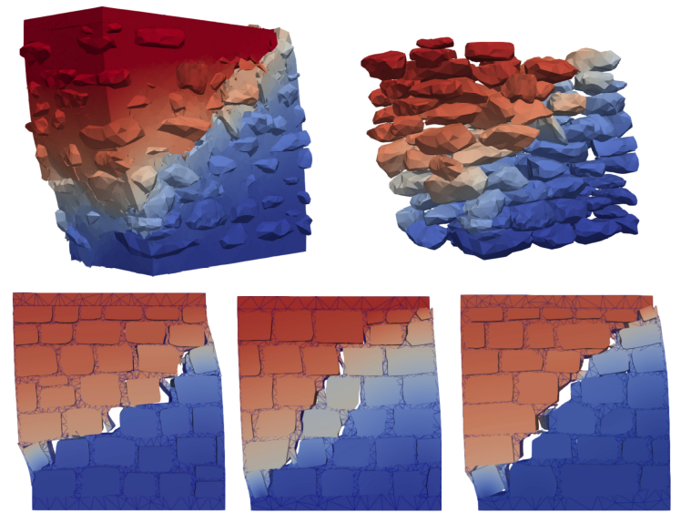

# Rigid Block Modeling for Pushover Analysis of Stone Masonry Walls



Wang, Q., Beyer, K. 
A 3D microscale modeling method for nonlinear static analysis of stone masonry walls using mathematical programming
```bash
@article{Wang_2026, 
title={A 3D microscale modeling method for nonlinear static analysis of stone masonry walls using mathematical programming}, volume={350}, 
ISSN={0141-0296}, 
url={http://dx.doi.org/10.1016/j.engstruct.2025.121953}, 
DOI={10.1016/j.engstruct.2025.121953}, 
journal={Engineering Structures}, 
publisher={Elsevier BV}, 
author={Wang, Qianqing and Beyer, Katrin}, 
year={2026}, 
month=mar, 
pages={121953} }
```
# Important Tips
👉 A 2D rigid block modeling method using mathematical programming is also free to use [Link](https://github.com/qianqing-wanggg/Image2Block)

💡 The height (the direction of gravity) is the x axis:


        x
        ↑
        |
        |
        0────────→ z
       /
      /
     y


# Set up Environment

Tested on **Ubuntu 20.04.6 LTS**.

## Step 1: Build Virtual Environment

```bash
python -m venv ./venv/
source ./venv/bin/activate
```

## Step 2: Configure Virtual Environment

```bash
cd path/to/setup.py
python setup.py develop
pip install -r requirements.txt
```

## Step 3: Obtain MOSEK License

Free academic and trial licenses are available at [MOSEK](https://www.mosek.com).

## Step 4: Install fTetWild
Install fTetWild by following the [instruction](https://github.com/wildmeshing/fTetWild).


# Usage
```bash
streamlit run ./software/src/app.py
```
